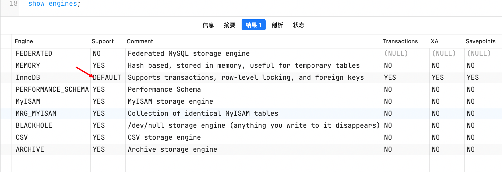
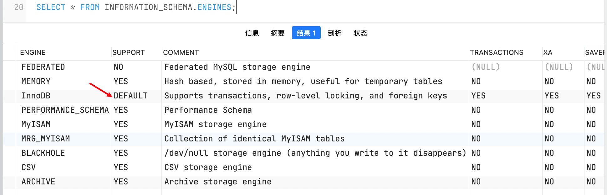

-   [15.1.1 Benefits of Using InnoDB Tables](https://dev.mysql.com/doc/refman/8.0/en/innodb-benefits.html)

    15.1.1 使用 InnoDB 表的优点

-   [15.1.2 Best Practices for InnoDB Tables](https://dev.mysql.com/doc/refman/8.0/en/innodb-best-practices.html)

    15.1.2 InnoDB 表最佳实践

-   [15.1.3 Verifying that InnoDB is the Default Storage Engine](https://dev.mysql.com/doc/refman/8.0/en/innodb-check-availability.html)

    15.1.3 确认 InnoDB 是默认存储引擎

-   [15.1.4 Testing and Benchmarking with InnoDB](https://dev.mysql.com/doc/refman/8.0/en/innodb-benchmarking.html)

    15.1.4 测试和基准测试 InnoDB 

`InnoDB` is a general-purpose storage engine that balances high reliability and high performance. In MySQL 8.0, `InnoDB` is the default MySQL storage engine. Unless you have configured a different default storage engine, issuing a [`CREATE TABLE`](https://dev.mysql.com/doc/refman/8.0/en/create-table.html) statement without an `ENGINE` clause creates an `InnoDB` table.

InnoDB 是一个在高可靠性和高性能之间寻求平衡的通用存储引擎。在 MySQL8 版本中，默认的 MySQL 存储引擎为 InnoDB。除非已经设置了一个不同的默认存储引擎，否则发出不带 engine 子句的 create table 语句将创建一个 InnoDB 表。

**Key Advantages of InnoDB**

**InnoDB 的关键优点**

-   Its DML operations follow the ACID model, with transactions featuring commit, rollback, and crash-recovery capabilities to protect user data. See [Section 15.2, “InnoDB and the ACID Model”](https://dev.mysql.com/doc/refman/8.0/en/mysql-acid.html).

    它的 DML 操作遵循 ACID 模型，事务具有提交、回滚和奔溃恢复功能，以保护用户数据。参考章节 15.2 InnoDB 和 ACID 模型。

-   Row-level locking and Oracle-style consistent reads increase multi-user concurrency and performance. See [Section 15.7, “InnoDB Locking and Transaction Model”](https://dev.mysql.com/doc/refman/8.0/en/innodb-locking-transaction-model.html).

    行锁和 Oracle 风格的一致性读增加多用户并发性和性能。参考章节 15.7 InnoDB 锁和事务模型。

-   `InnoDB` tables arrange your data on disk to optimize queries based on primary keys. Each `InnoDB` table has a primary key index called the clustered index that organizes the data to minimize I/O for primary key lookups. See [Section 15.6.2.1, “Clustered and Secondary Indexes”](https://dev.mysql.com/doc/refman/8.0/en/innodb-index-types.html).

    InnoDB 表在磁盘上排列数据，以优化基于主键的查询。每个 InnoDB 表都有一个主键索引，称为聚簇索引，用来组织数据以最小化主键查找的 I/O。参考章节 15.6.2.1 聚簇和二级索引。

-   To maintain data integrity, `InnoDB` supports `FOREIGN KEY` constraints. With foreign keys, inserts, updates, and deletes are checked to ensure they do not result in inconsistencies across related tables. See [Section 13.1.20.5, “FOREIGN KEY Constraints”](https://dev.mysql.com/doc/refman/8.0/en/create-table-foreign-keys.html).

    为了保持数据完整性，InnoDB 支持外键约束。对于外键，将检查插入、更新和删除，以确保它们不会导致相关表之间的不一致。参考章节 13.1.20.5 外键约束。

    

**Table 15.1 InnoDB Storage Engine Features**

**InnoDB 存储引擎特性**

| Feature                                                      | Support                                                      |
| :----------------------------------------------------------- | :----------------------------------------------------------- |
| **B-tree indexes**                                           | Yes                                                          |
| **Backup/point-in-time recovery** (Implemented in the server, rather than in the storage engine.) | Yes                                                          |
| **Cluster database support**                                 | No                                                           |
| **Clustered indexes**                                        | Yes                                                          |
| **Compressed data**                                          | Yes                                                          |
| **Data caches**                                              | Yes                                                          |
| **Encrypted data**                                           | Yes (Implemented in the server via encryption functions; In MySQL 5.7 and later, data-at-rest encryption is supported.) |
| **Foreign key support**                                      | Yes                                                          |
| **Full-text search indexes**                                 | Yes (Support for FULLTEXT indexes is available in MySQL 5.6 and later.) |
| **Geospatial data type support**                             | Yes                                                          |
| **Geospatial indexing support**                              | Yes (Support for geospatial indexing is available in MySQL 5.7 and later.) |
| **Hash indexes**                                             | No (InnoDB utilizes hash indexes internally for its Adaptive Hash Index feature.) |
| **Index caches**                                             | Yes                                                          |
| **Locking granularity**                                      | Row                                                          |
| **MVCC**                                                     | Yes                                                          |
| **Replication support** (Implemented in the server, rather than in the storage engine.) | Yes                                                          |
| **Storage limits**                                           | 64TB                                                         |
| **T-tree indexes**                                           | No                                                           |
| **Transactions**                                             | Yes                                                          |
| **Update statistics for data dictionary**                    | Yes                                                          |


To compare the features of `InnoDB` with other storage engines provided with MySQL, see the *Storage Engine Features* table in [Chapter 16, *Alternative Storage Engines*](https://dev.mysql.com/doc/refman/8.0/en/storage-engines.html).


**InnoDB Enhancements and New Features**

For information about `InnoDB` enhancements and new features, refer to:

-   The `InnoDB` enhancements list in [Section 1.3, “What Is New in MySQL 8.0”](https://dev.mysql.com/doc/refman/8.0/en/mysql-nutshell.html).
-   The [Release Notes](https://dev.mysql.com/doc/relnotes/mysql/8.0/en/).

**Additional InnoDB Information and Resources**

-   For `InnoDB`-related terms and definitions, see the [MySQL Glossary](https://dev.mysql.com/doc/refman/8.0/en/glossary.html).
-   For a forum dedicated to the `InnoDB` storage engine, see [MySQL Forums::InnoDB](http://forums.mysql.com/list.php?22).
-   `InnoDB` is published under the same GNU GPL License Version 2 (of June 1991) as MySQL. For more information on MySQL licensing, see http://www.mysql.com/company/legal/licensing/.


## 15.1.1 Benefits of Using InnoDB Tables

`InnoDB` tables have the following benefits:

InnoDB 表有以下优点：

-   If the server unexpectedly exits because of a hardware or software issue, regardless of what was happening in the database at the time, you don't need to do anything special after restarting the database. `InnoDB` crash recovery automatically finalizes changes that were committed before the time of the crash, and undoes changes that were in process but not committed, permitting you to restart and continue from where you left off. See [Section 15.18.2, “InnoDB Recovery”](https://dev.mysql.com/doc/refman/8.0/en/innodb-recovery.html).

    如果服务器由于硬件或者软件问题而意外退出，无论当时数据库中发生了什么，在重新启动数据库后都不需要执行任何特殊操作。InnoDB 奔溃恢复会自动结束在奔溃之前提交的更改，并撤销正在处理但没有提交的更改，允许你重新启动并从停止的地方继续。

-   The `InnoDB` storage engine maintains its own buffer pool that caches table and index data in main memory as data is accessed. Frequently used data is processed directly from memory. This cache applies to many types of information and speeds up processing. On dedicated database servers, up to 80% of physical memory is often assigned to the buffer pool. See [Section 15.5.1, “Buffer Pool”](https://dev.mysql.com/doc/refman/8.0/en/innodb-buffer-pool.html).

    InnoDB 存储引擎维护自己的缓冲池，在访问数据时将表和索引数据缓存到主内存中。经常使用的数据直接从内存中处理。这种缓存适用于许多类型的信息，并加快了处理速度。在专用数据库服务器上，高达 80% 的物理内存通常分配给缓冲池。

-   If you split up related data into different tables, you can set up foreign keys that enforce referential integrity. See [Section 13.1.20.5, “FOREIGN KEY Constraints”](https://dev.mysql.com/doc/refman/8.0/en/create-table-foreign-keys.html).

    如果将相关数据拆分到不同的表中，则可以设置强制引用完整性的外键。

-   If data becomes corrupted on disk or in memory, a checksum mechanism alerts you to the bogus data before you use it. The [`innodb_checksum_algorithm`](https://dev.mysql.com/doc/refman/8.0/en/innodb-parameters.html#sysvar_innodb_checksum_algorithm) variable defines the checksum algorithm used by `InnoDB`.

    如果磁盘或内存中的数据损坏，在使用这些数据之前，检验和机制会向您发出警告。变量 innodb_checksum_algorithm 定义了 InnoDB 使用的校验和算法。

-   When you design a database with appropriate primary key columns for each table, operations involving those columns are automatically optimized. It is very fast to reference the primary key columns in [`WHERE`](https://dev.mysql.com/doc/refman/8.0/en/select.html) clauses, [`ORDER BY`](https://dev.mysql.com/doc/refman/8.0/en/select.html) clauses, [`GROUP BY`](https://dev.mysql.com/doc/refman/8.0/en/select.html) clauses, and join operations. See [Section 15.6.2.1, “Clustered and Secondary Indexes”](https://dev.mysql.com/doc/refman/8.0/en/innodb-index-types.html).

    当为每个表设计具有适当主键列的数据库时，涉及这些列的操作将自动优化。在 where 子句、order by 子句、group by 子句和 join 操作中引用主键列会非常快。

-   Inserts, updates, and deletes are optimized by an automatic mechanism called change buffering. `InnoDB` not only allows concurrent read and write access to the same table, it caches changed data to streamline disk I/O. See [Section 15.5.2, “Change Buffer”](https://dev.mysql.com/doc/refman/8.0/en/innodb-change-buffer.html).

    insert、update、delete 是通过一种称为 change buffer 的自动机制进行优化的。InnoDB 不仅允许对同一个表进行并发读和写访问，它还可以缓存更改的数据以简化磁盘 I/O。

-   Performance benefits are not limited to large tables with long-running queries. When the same rows are accessed over and over from a table, the Adaptive Hash Index takes over to make these lookups even faster, as if they came out of a hash table. See [Section 15.5.3, “Adaptive Hash Index”](https://dev.mysql.com/doc/refman/8.0/en/innodb-adaptive-hash.html).

    TODO

-   You can compress tables and associated indexes. See [Section 15.9, “InnoDB Table and Page Compression”](https://dev.mysql.com/doc/refman/8.0/en/innodb-compression.html).

    可以压缩表和相关的索引。

-   You can encrypt your data. See [Section 15.13, “InnoDB Data-at-Rest Encryption”](https://dev.mysql.com/doc/refman/8.0/en/innodb-data-encryption.html).

    可以加密数据。

-   You can create and drop indexes and perform other DDL operations with much less impact on performance and availability. See [Section 15.12.1, “Online DDL Operations”](https://dev.mysql.com/doc/refman/8.0/en/innodb-online-ddl-operations.html).

    可以创建和删除索引，并执行其他 DDL 操作，而对性能和可用性的影响要小得多。

-   Truncating a file-per-table tablespace is very fast and can free up disk space for the operating system to reuse rather than only `InnoDB`. See [Section 15.6.3.2, “File-Per-Table Tablespaces”](https://dev.mysql.com/doc/refman/8.0/en/innodb-file-per-table-tablespaces.html).

    清空一个 file-per-table 表空间会非常快，可以释放磁盘空间给操作系统重用，而不仅仅是 InnoDB 存储引擎。

-   The storage layout for table data is more efficient for [`BLOB`](https://dev.mysql.com/doc/refman/8.0/en/blob.html) and long text fields, with the `DYNAMIC` row format. See [Section 15.10, “InnoDB Row Formats”](https://dev.mysql.com/doc/refman/8.0/en/innodb-row-format.html).

    对于 BLOB 和使用 DYNAMIC 行格式的 long text 字段，表数据的存储布局更有效。

-   You can monitor the internal workings of the storage engine by querying `INFORMATION_SCHEMA` tables. See [Section 15.15, “InnoDB INFORMATION_SCHEMA Tables”](https://dev.mysql.com/doc/refman/8.0/en/innodb-information-schema.html).

    可以通过查询 INFORMATION_SCHEMA 表来监控存储引擎的内部工作情况。

-   You can monitor the performance details of the storage engine by querying Performance Schema tables. See [Section 15.16, “InnoDB Integration with MySQL Performance Schema”](https://dev.mysql.com/doc/refman/8.0/en/innodb-performance-schema.html).

    可以通过查询 Performance Schema 表来监控存储引擎的性能细节。

-   You can mix `InnoDB` tables with tables from other MySQL storage engines, even within the same statement. For example, you can use a join operation to combine data from `InnoDB` and [`MEMORY`](https://dev.mysql.com/doc/refman/8.0/en/memory-storage-engine.html) tables in a single query.

    可以将 InnoDB 表与其他 MySQL 存储引擎的表混合使用，甚至在同一条语句中。例如，可以使用一个 join 操作将来自 InnoDB 和 MEMORY 表的数据合并到一个查询中。

-   `InnoDB` has been designed for CPU efficiency and maximum performance when processing large data volumes.

    在处理大数据量时，InnoDB 被设计为 CPU 效率和最大性能。

-   `InnoDB` tables can handle large quantities of data, even on operating systems where file size is limited to 2GB.

    InnoDB 表可以处理大量的数据，即使在文件大小限制为 2GB 的操作系统上。

For `InnoDB`-specific tuning techniques you can apply to your MySQL server and application code, see [Section 8.5, “Optimizing for InnoDB Tables”](https://dev.mysql.com/doc/refman/8.0/en/optimizing-innodb.html).

对于 InnoDB 特定的调优技术，你可以应用到你的 MySQL 服务器和应用程序代码。

## 15.1.2 Best Practices for InnoDB Tables

This section describes best practices when using `InnoDB` tables.

本章节介绍当使用 InnoDB 表时的最佳实践。

-   Specify a primary key for every table using the most frequently queried column or columns, or an auto-increment value if there is no obvious primary key.

    使用最常查询的列为每个表指定一个主键，如果没有明显的主键，则指定一个自动递增的值。

-   Use joins wherever data is pulled from multiple tables based on identical ID values from those tables. For fast join performance, define foreign keys on the join columns, and declare those columns with the same data type in each table. Adding foreign keys ensures that referenced columns are indexed, which can improve performance. Foreign keys also propagate deletes and updates to all affected tables, and prevent insertion of data in a child table if the corresponding IDs are not present in the parent table.

    在基于来自多个表的相同 ID 值从这些表中提取数据的地方使用连接。为了获得快速连接性能，请在连接列上定义外键，并在每个表中声明具有相同数据类型的列。添加外键可以确保对引用的列进行索引，这可以提高性能。外键还将删除和更改传播到所有受影响的表，如果父表中没有相应的 id，则阻止在子表中插入数据。

    >   外键可能要慎用

-   Turn off autocommit. Committing hundreds of times a second puts a cap on performance (limited by the write speed of your storage device).

    关闭自动提交。每秒提交数百次会限制性能（受存储设备的写速度限制）。

    >   如果团队开发水平较低，不要关闭自动提交，否则会导致长事务。如果团队开发水平较高，即开发人员知道何时开启事务，何时提交事务，何时回滚事务，那么关闭自动提交，让开发人员自己决定何时提交，可以大幅度提高性能。

-   Group sets of related DML operations into transactions by bracketing them with `START TRANSACTION` and `COMMIT` statements. While you don't want to commit too often, you also don't want to issue huge batches of [`INSERT`](https://dev.mysql.com/doc/refman/8.0/en/insert.html), [`UPDATE`](https://dev.mysql.com/doc/refman/8.0/en/update.html), or [`DELETE`](https://dev.mysql.com/doc/refman/8.0/en/delete.html) statements that run for hours without committing.

    通过用 start transaction 和 commit 语句将相关的 DML 操作集合分组到事务中。虽然您不希望过于频繁地提交，但您也不希望发出大量的 insert、update、delete 语句，这些语句运行数小时而不提交。

-   Do not use [`LOCK TABLES`](https://dev.mysql.com/doc/refman/8.0/en/lock-tables.html) statements. `InnoDB` can handle multiple sessions all reading and writing to the same table at once without sacrificing reliability or high performance. To get exclusive write access to a set of rows, use the [`SELECT ... FOR UPDATE`](https://dev.mysql.com/doc/refman/8.0/en/innodb-locking-reads.html) syntax to lock just the rows you intend to update.

    不要使用 lock tables 语句。InnoDB 可以同时处理多个对同一个表的读写会话，而不会牺牲可靠性和高性能。要获得对一组行的独占写访问权，可以使用 select … for update 语法锁定要更新的行。

-   Enable the [`innodb_file_per_table`](https://dev.mysql.com/doc/refman/8.0/en/innodb-parameters.html#sysvar_innodb_file_per_table) variable or use general tablespaces to put the data and indexes for tables into separate files instead of the system tablespace. The [`innodb_file_per_table`](https://dev.mysql.com/doc/refman/8.0/en/innodb-parameters.html#sysvar_innodb_file_per_table) variable is enabled by default.

    启用 innodb_file_per_table 变量或者使用通用表空间将表的数据和索引放入单独的文件中，而不是系统表空间。innodb_file_per_table 变量默认是启用的。

-   Evaluate whether your data and access patterns benefit from the `InnoDB` table or page compression features. You can compress `InnoDB` tables without sacrificing read/write capability.

    评估数据和访问模式是否受益于 InnoDB 表或页压缩特性。你可以压缩 InnoDB 表而不牺牲读/写能力

-   Run the server with the [`--sql_mode=NO_ENGINE_SUBSTITUTION`](https://dev.mysql.com/doc/refman/8.0/en/server-system-variables.html#sysvar_sql_mode) option to prevent tables from being created with storage engines that you do not want to use.

    使用 --sql_mode=NO_ENGINE_SUBSTITUTION 选项运行服务器，以防止使用不希望使用的存储引擎创建表。

    >   disabled_storage_engines 这个变量才能禁用掉存储引擎


## 15.1.3 Verifying that InnoDB is the Default Storage Engine

Issue the [`SHOW ENGINES`](https://dev.mysql.com/doc/refman/8.0/en/show-engines.html) statement to view the available MySQL storage engines. Look for `DEFAULT` in the `SUPPORT` column.

```sql
mysql> SHOW ENGINES;
```



Alternatively, query the [`INFORMATION_SCHEMA.ENGINES`](https://dev.mysql.com/doc/refman/8.0/en/information-schema-engines-table.html) table.

```sql
mysql> SELECT * FROM INFORMATION_SCHEMA.ENGINES;
```




## 15.1.4 Testing and Benchmarking with InnoDB

If `InnoDB` is not the default storage engine, you can determine if your database server and applications work correctly with `InnoDB` by restarting the server with [`--default-storage-engine=InnoDB`](https://dev.mysql.com/doc/refman/8.0/en/server-system-variables.html#sysvar_default_storage_engine) defined on the command line or with [`default-storage-engine=innodb`](https://dev.mysql.com/doc/refman/8.0/en/server-system-variables.html#sysvar_default_storage_engine) defined in the `[mysqld]` section of the MySQL server option file.

如果 InnoDB 不是默认存储引擎，你可以通过在命令行中定义的 --default-storage-engine=InnoDB 或在 MySQL 服务器选项文件的 [mysqld] 部分中定义的 default-storage-engine=innodb 重新启动服务器来确定你的数据库服务器和应用程序是否可以正常使用 InnoDB。

Since changing the default storage engine only affects newly created tables, run your application installation and setup steps to confirm that everything installs properly, then exercise the application features to make sure the data loading, editing, and querying features work. If a table relies on a feature that is specific to another storage engine, you receive an error. In this case, add the ENGINE=other_engine_name clause to the [CREATE TABLE](https://dev.mysql.com/doc/refman/8.0/en/create-table.html) statement to avoid the error.

因为更改默认存储引擎只影响新创建的表，所以要运行应用程序安装和设置步骤，以确认所有内容都正确安装，然后测试应用程序特性，以确保数据加载、编辑和查询特性正常工作。如果表依赖于另一个存储引擎的特性，则会收到一个错误。在本例中，将 ENGINE=other_engine_name 子句添加到 create table 语句以避免错误。

If you did not make a deliberate decision about the storage engine, and you want to preview how certain tables work when created using `InnoDB`, issue the command [`ALTER TABLE table_name ENGINE=InnoDB;`](https://dev.mysql.com/doc/refman/8.0/en/alter-table.html) for each table. Alternatively, to run test queries and other statements without disturbing the original table, make a copy:

如果你没有做一个关于存储引擎的决定，并且向玉兰某些表在使用 InnoDB 创建时是如何工作的，发出命令 ALTER TABLE table_name ENGINE=InnoDB; 为每个表。或者，在不干扰原始表的情况下运行测试查询和其他语句，做一个副本：

```sql
CREATE TABLE ... ENGINE=InnoDB AS SELECT * FROM other_engine_table;
```

To assess performance with a full application under a realistic workload, install the latest MySQL server and run benchmarks.

要在实际工作负载下使用完整的应用程序评估性能，请安装最新的 MySQL 服务器并运行基准测试。

Test the full application lifecycle, from installation, through heavy usage, and server restart. Kill the server process while the database is busy to simulate a power failure, and verify that the data is recovered successfully when you restart the server.

测试整个应用程序生命周期，从安装到大量使用，再到服务器重新启动。在数据库繁忙时关闭服务器进程，以模拟电源故障，并在重新启动服务器时验证数据是否成功恢复。

Test any replication configurations, especially if you use different MySQL versions and options on the source server and replicas.

测试任何复制配置，特别是如果您在源服务器上和副本上使用不同的 MySQL 版本和选项。